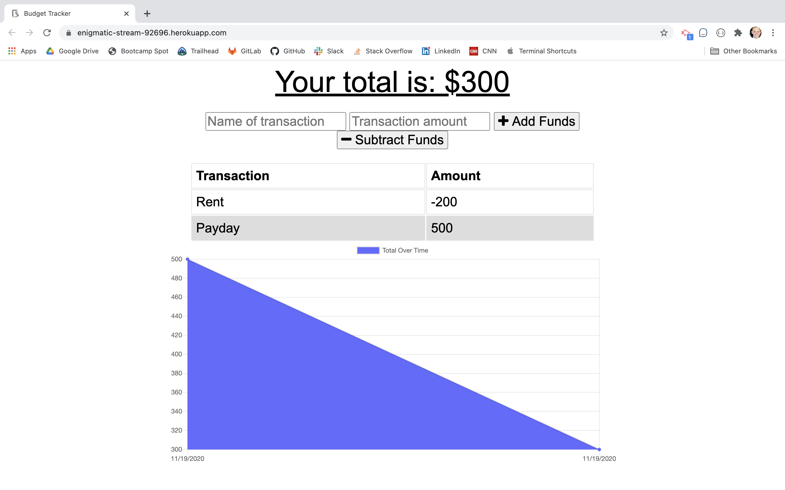

# BUDGET TRACKER

[Find this app here](https://budget-trackerzb.herokuapp.com/)

---

[https://budget-trackerzb.herokuapp.com](https://budget-trackerzb.herokuapp.com)
---
## Description

Giving users a fast and easy way to track their money is important, but allowing them to access that information anytime is even more important. Having offline functionality is paramount to our applications success. As a PWA, Progressive Web App, it is intended to work on any standard complaint browser. This includes both desktop and mobile devices. On your mobile you are able to create a short cut to the home screen.

---
### Table of Contents

* [Description](#description)
* [Installation](#installation)
* [Technologies](#technologies)
* [Contributing](#contributing)
* [Questions](#questions)
* [Usage](#usage)
* [License](#licence)

---
### Installation

This project can be accessed through any internet capable browser. If you would like to modify the code itself:

* Run npm install to get all dependencies
* Spin up a MongoDB database: Locally or Cloud Service such as MongoDB Atlas.
* Declare personal connection string as URI in a .env file within the base directory

---
### Technologies

* Indexed Database - A javascript application programming interface provided by web browsers for managing a NoSQL database of JSON objects. Used for implementation of mobile devices

* Morgan -  Request logger middleware for Node.js. It helps with to log requests to the application.

* Mongoose - Object Data Modeling(ODM) library that provides a modeling environment for the data. A cross platform web server with functions that help with HTTP client + server,and other.
* Mongodb -  Document-oriented NoSQL database. Uses JSON-like documents with optional schemas.
* Express - Web application server framework through Node.js. It is designed for building single page, multi page, and hybrid web applications.
* Node JS - Used for executing JavaScript coding to build a CLI for server-side scripting
* Javascript - Code that gives functionality of functions for implementing code in this application

---
### Contributing

- [Plover Brown](https://github.com/rebgrasshopper)
- [Kira Bismuth Lowrey](https://github.com/KILowrey)
- [Nancy Lambert-Brown](https://github.com/n-lambert)
- [Mando Estrada](https://github.com/Mando619)
- [Perry Theobald](https://github.com/perrytjr)
- [Jeneth Diestra](https://github.com/jen6one9)
- [Matthew Rogers](https://github.com/Rogers-Development-Services)
- [Jefrrey Choi](https://github.com/jepoy92)
- [Clyde Baron Rapinan](https://github.com/clydebaron2000)
- [Johnny Lieu](https://github.com/johnnylieu)
- [Robert Graham](https://github.com/Robmgraham)

---
### Questions

For any additional questions or update requests please contact me via [Email](zacharybryan@icloud.com)

[Github](https://www.github.com/zacharybryan)
[LinkedIn](https://www.linkedin.com/in/zachary-bryan-2858031aa/)
[Portfolio](https://zacharybryan.github.io/responsivePortfolio/portfolio.html)
---
### Usage

You may use this code in any way you please that follows the GNU license

---
### License

GNU General Public License v3.0

---
Copyright (c) 2020 Zachary Bryan
